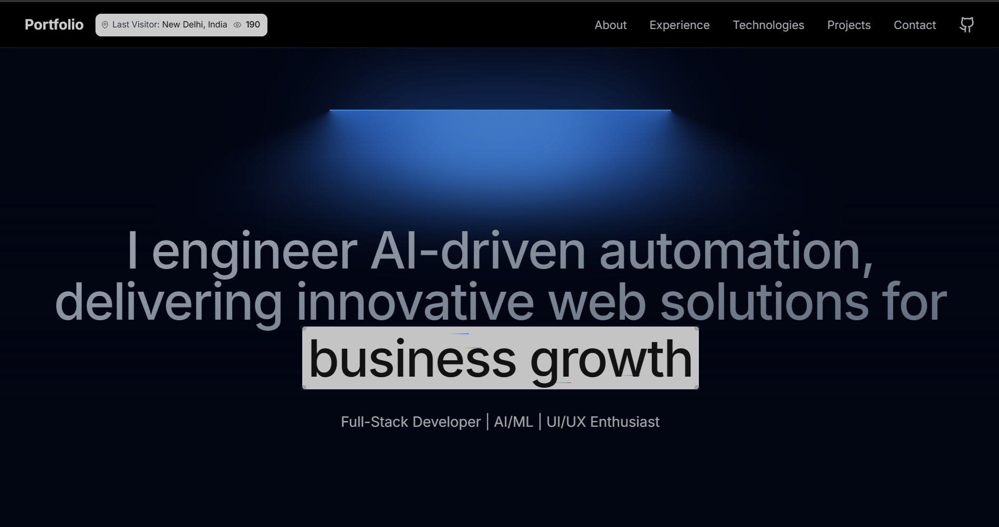
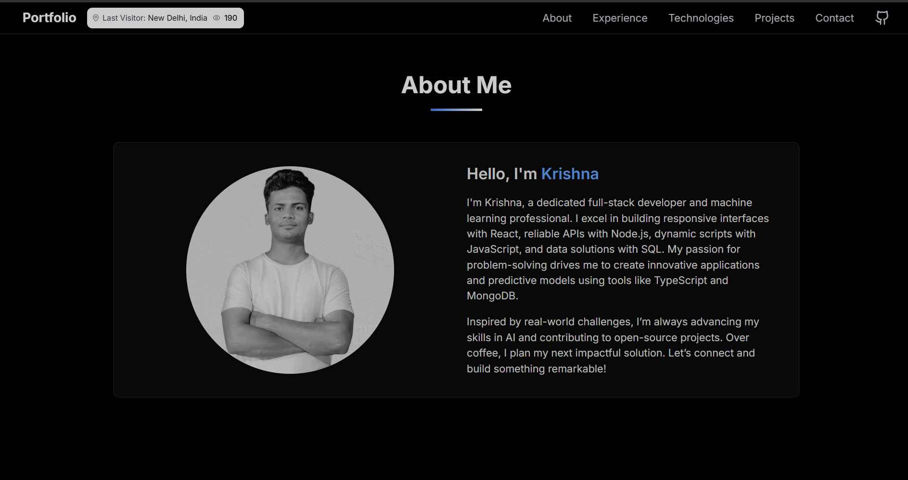
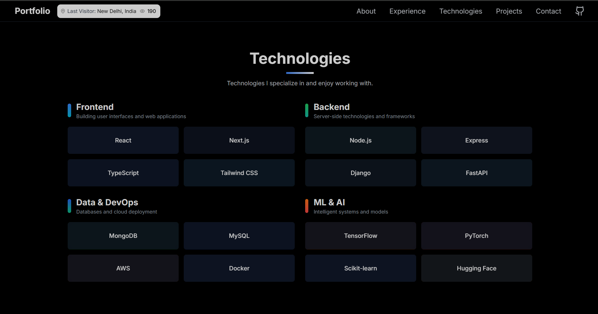
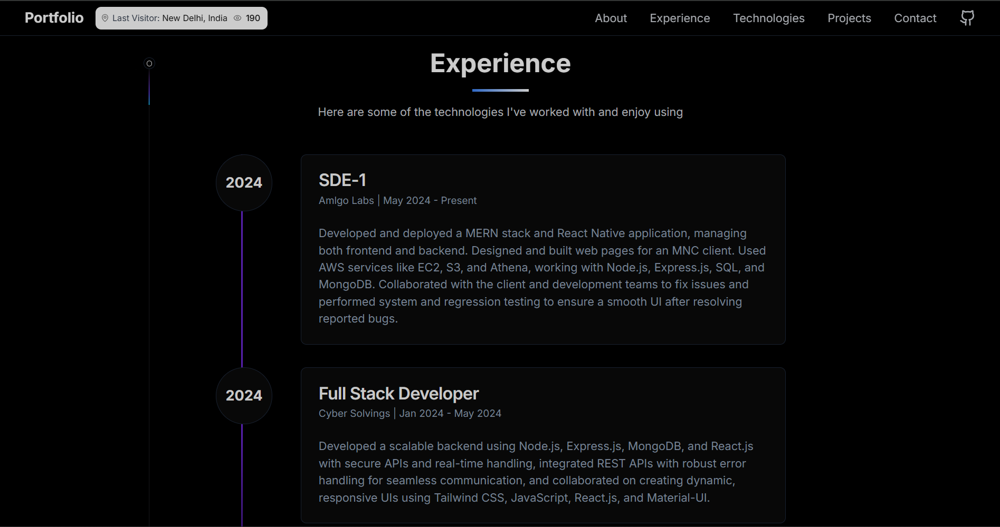
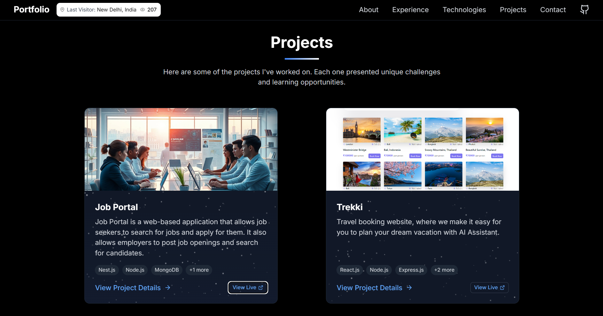
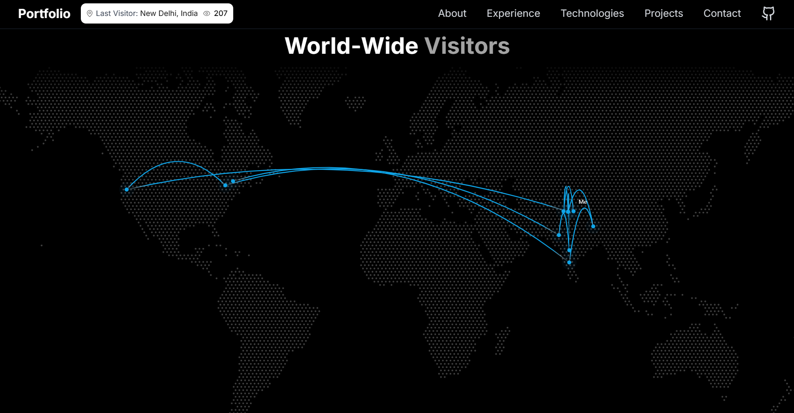

# Personal Portfolio Website (Next.js)

This is a **modern portfolio website** built with **Next.js**, **TailwindCSS**, and **Aceternity UI**, designed to showcase your projects, track visitor insights, and send automatic resume emails.

---

## Tech Stack

- **Framework**: [Next.js](https://nextjs.org/)
- **Styling**: [TailwindCSS](https://tailwindcss.com/)
- **UI Library**: [Aceternity UI](https://ui.aceternity.com/)
- **Emailing**: [Nodemailer](https://nodemailer.com/)
- **Geolocation**: [IP2Location API](https://www.ip2location.com/)
- **Database**: [MongoDB Atlas](https://www.mongodb.com/)
- **Deployment**: [Vercel](https://vercel.com/)
- **Map**: World map from **Aceternity UI**

---

## Features

- ✅ Built with **Next.js** and **TailwindCSS**
- ✅ Sleek animated components via **Aceternity UI**
- ✅ Dynamic Resume Download + Contact Form
- ✅ **Visitor Analytics**:
  - 🌍 World Map (via Aceternity UI)
  - 👤 Show **Last Visitor City & Country** (IP2Location)
  - 📊 Display **Total Visitors** (stored in MongoDB)
- ✅ **Auto Resume Reply** via **Nodemailer**
- ✅ Stores contact + visitor info in **MongoDB**
- ✅ Fully Responsive & Mobile Friendly
- ✅ SEO Optimized
- ✅ Deployed on **Vercel**

---

## 📸 Screenshots

Here’s a preview of how the **Personal Portfolio Website** looks:

### Landing View


### About Me


### Technologies


### Experience


### Projects


### World-wide Visitors


## ⚙️ Environment Variables

Create a `.env.local` file in the root directory and add the following:

```env
NEXT_PUBLIC_IP2LOCATION_API_KEY=your_ip2location_api_key

NEXT_PUBLIC_MONGODB_URI=your_mongodb_connection_string
# For local MongoDB testing:
# NEXT_PUBLIC_MONGODB_URI=mongodb://localhost:27017/testDB

NEXT_PUBLIC_MONGODB_DB=your_mongodb_database_name

NEXT_PUBLIC_EMAIL_USER=your_email_address
NEXT_PUBLIC_EMAIL_PASS=your_email_password_or_app_token

NEXT_PUBLIC_RESUME_LINK=your_resume_google_drive_or_hosted_link

NEXT_PUBLIC_URL=http://localhost:3000
# Or for production:
# NEXT_PUBLIC_URL=https://your-live-site-url.com
```

> 🛑 **Note**: Never share or commit your real credentials publicly!

---

## 📦 Installation

```bash
# Clone the repo
git clone https://github.com/Krishna11118/Portfoliogit.git
cd Portfoliogit

# Install dependencies
npm install
# or
yarn install
```

---

## Email Setup Instructions

### If You Don’t Use 2-Step Verification
Go to your [Google Account settings](https://myaccount.google.com/lesssecureapps).  
Enable **"Allow less secure apps"**.

### If You Use 2-Step Verification (Recommended for Security)
Go to your [App Passwords settings](https://myaccount.google.com/apppasswords) in your Google Account.


## 🚀 Run Locally

```bash
npm run dev
# or
yarn dev
```

Open [http://localhost:3000](http://localhost:3000) to view it in the browser.

---

## 📩 Auto-Resume via Nodemailer

- Users who contact you get an **automated resume email**
- Data is stored in **MongoDB**
- SMTP credentials are securely managed using environment variables

---

## 🗺️ Visitor Tracking + Map

- Uses **IP2Location API** to fetch visitor country & city
- Tracks and stores all visits in **MongoDB**
- Displays:
  - ✅ Total Visits
  - 🌍 Last Visitor’s City & Country
  - 🗺️ Live map of visitors via **Aceternity UI**

---

## 🌍 Deployment (Vercel)

1. Push your code to GitHub
2. Go to [https://vercel.com](https://vercel.com)
3. Import your repo and add the `.env.local` values to Vercel
4. Deploy in 1 click!

---

## 🧑‍💻 Author

**Krishna**  
📫 [LinkedIn](https://linkedin.com/in/krishna365)  
📧 krishnasss365@gmail.com  
🌐 [Live Demo](https://krishnastonetech.live/)

---

## 📄 License

This project is licensed under the [MIT License](LICENSE)

---
### ⭐⭐⭐⭐ Please Add ⭐ if you liked this repo ⭐⭐⭐⭐

